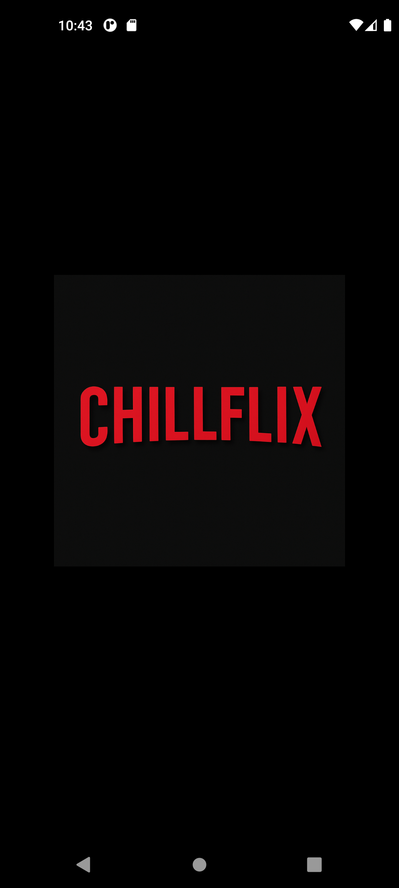
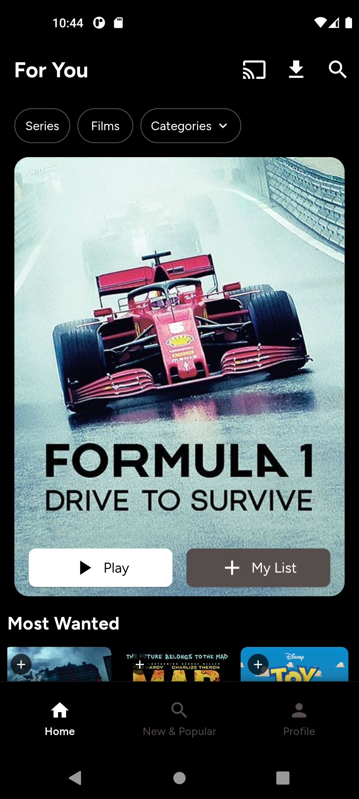
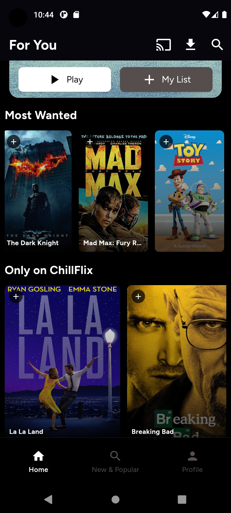
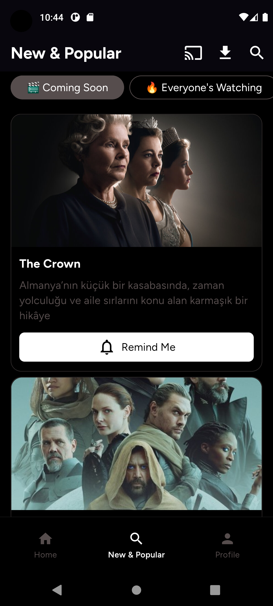
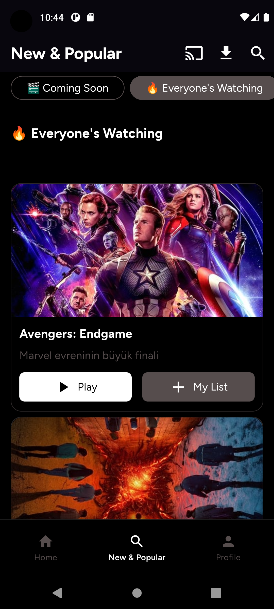
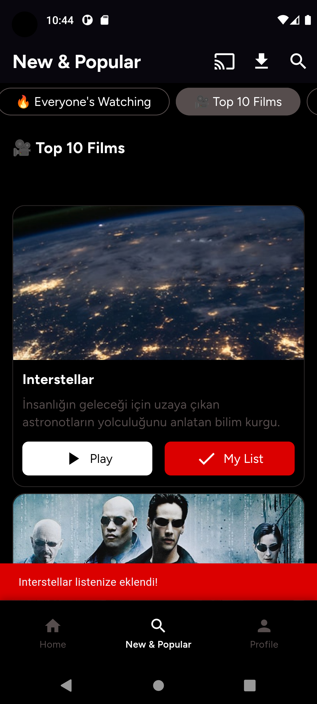
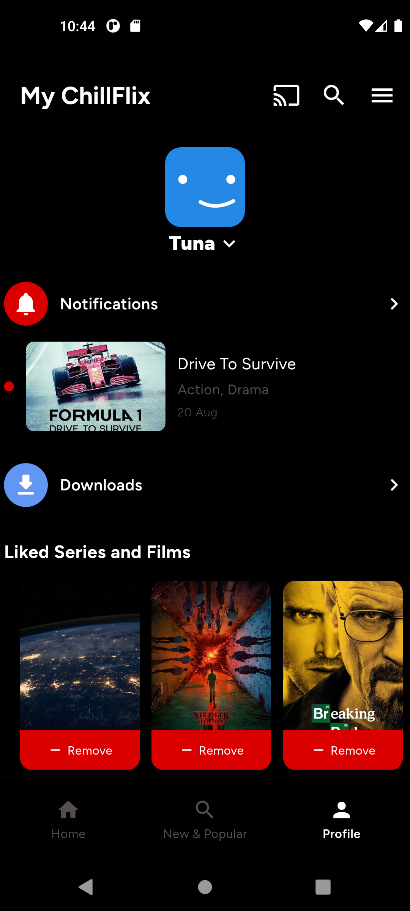
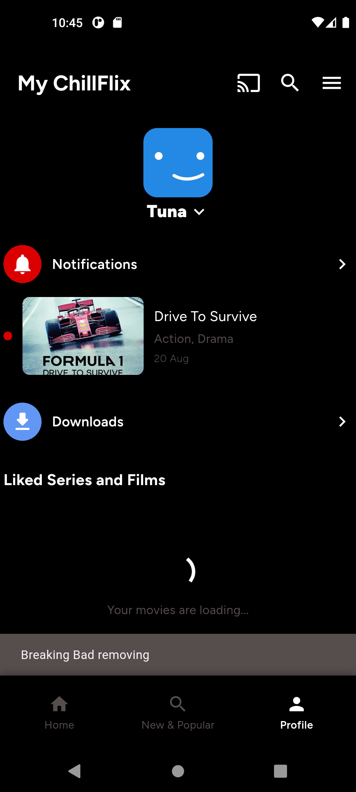
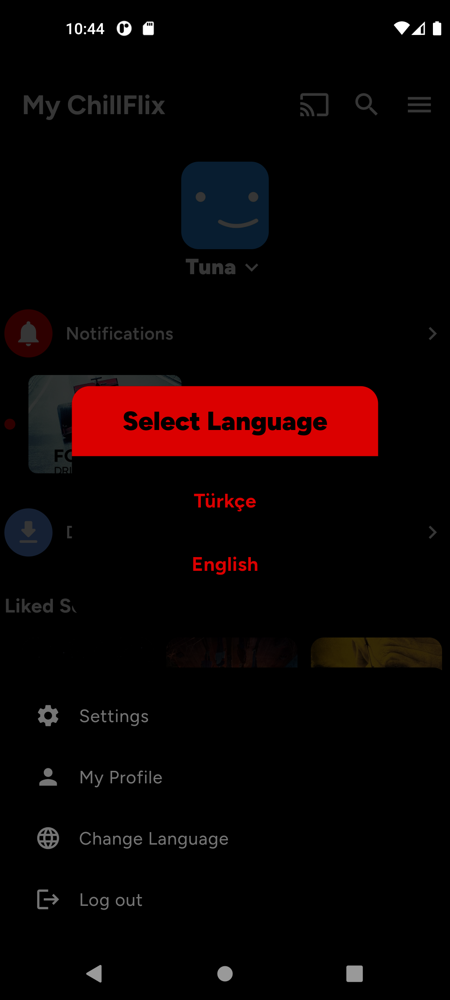

# ChillFlix - Netflix Clone

A Netflix-like movie and TV series streaming app developed with Firebase integration.

## Features

- 🔐 User authentication with Firebase Authentication
- 🎬 Movie and series listing by categories
- ⭐ Categories: Most Wanted, Only on ChillFlix, Coming Soon, Everyone Watch These
- 📊 Top 10 Films and Top 10 Series lists
- 📋 User personal list ("My List")
- 🌍 Turkish and English language support
- 📱 Responsive design

## Firebase Setup

### 1. Create a Firebase Project

1. Go to [Firebase Console](https://console.firebase.google.com/)
2. Click "Add project" to create a new project
3. Name your project "chillflix-app"

### 2. Set Up Authentication

1. Select "Authentication" from the left menu
2. Click "Get started"
3. In the "Sign-in method" tab, enable "Email/Password"
4. Click "Enable"

### 3. Set Up Firestore Database

1. Select "Firestore Database" from the left menu
2. Click "Create database"
3. Choose "Start in test mode"
4. Select region "europe-west1"

### 4. Add Firebase to Flutter App

1. In Firebase Console, go to "Project settings" > "General"
2. Under "Your apps", click the "Android" icon
3. Android package name: `com.example.chillflix_app`
4. Download the `google-services.json` file
5. Copy the file to your `android/app/` directory

6. For iOS:
   - Click the "iOS" icon
   - Bundle ID: `com.example.chillflixApp`
   - Download `GoogleService-Info.plist`
   - Add it to your iOS directory

### 5. Add Firestore Data

Add sample data from `firebase_data_setup.dart` to Firestore:

1. Firestore Database > Data > "Start collection"
2. Collection ID: `movies`
3. Create a separate document for each movie
4. Example data:

```json
{
  "title": "The Dark Knight",
  "description": "Batman's fight against the Joker",
  "imageUrl": "https://image.tmdb.org/t/p/w500/qJ2tW6WMUDux911r6m7haRef0WH.jpg",
  "category": "most_wanted",
  "rating": 9.0,
  "year": 2008,
  "duration": 152,
  "genres": ["Action", "Crime", "Drama"],
  "director": "Christopher Nolan",
  "cast": ["Christian Bale", "Heath Ledger", "Aaron Eckhart"],
  "isSeries": false,
  "seasonCount": 0,
  "createdAt": Timestamp.now()
}
```

### 6. Firestore Rules

Go to Firestore Database > Rules and add:

```javascript
rules_version = '2';
service cloud.firestore {
  match /databases/{database}/documents {
    // Anyone can read movie data
    match /movies/{document} {
      allow read: if true;
      allow write: if request.auth != null;
    }
    
    // User list is only accessible by its owner
    match /userLists/{document} {
      allow read, write: if request.auth != null && request.auth.uid == resource.data.userId;
    }
  }
}
```

## Categories

### 1. Most Wanted
- Most popular and highly rated movies
- `category: "most_wanted"`

### 2. Only on ChillFlix
- Platform exclusive content
- `category: "only_on_chillflix"`

### 3. Coming Soon
- Upcoming content
- `category: "coming_soon"`

### 4. Everyone Watch These
- Must-watch content for everyone
- `category: "everyone_watch_these"`

### 5. Top 10 Films
- Top 10 movies (`isSeries: false`)
- Sorted by rating

### 6. Top 10 Series
- Top 10 series (`isSeries: true`)
- Sorted by rating

## My List Feature

- Users can add movies to their list by clicking the "+" button on movie cards
- Added movies appear in the "My List" section on the profile page
- Remove movies from the list with the "-" button
- Each user's list is stored separately

## Firebase Collections

### movies Collection
```
{
  title: String,
  description: String,
  imageUrl: String,
  category: String,
  rating: Number,
  year: Number,
  duration: Number,
  genres: Array<String>,
  director: String,
  cast: Array<String>,
  isSeries: Boolean,
  seasonCount: Number,
  createdAt: Timestamp
}
```

### userLists Collection
```
{
  userId: String,
  movieId: String,
  movieTitle: String,
  movieImageUrl: String,
  addedAt: Timestamp
}
```

## Installation

```bash
# Install dependencies
flutter pub get

# Run the app
flutter run
```

## Technologies

- Flutter
- Firebase (Authentication, Firestore)
- BLoC Pattern
- Flutter Localizations
- Google Fonts

## Screenshot












## License

This project is developed for educational purposes.